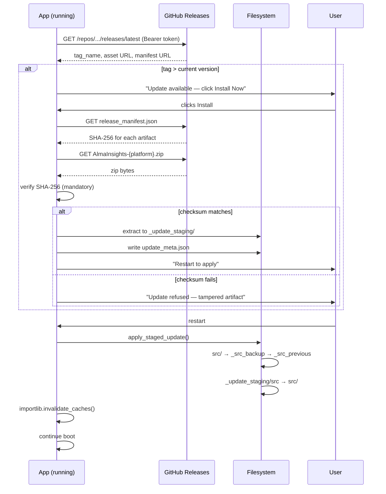
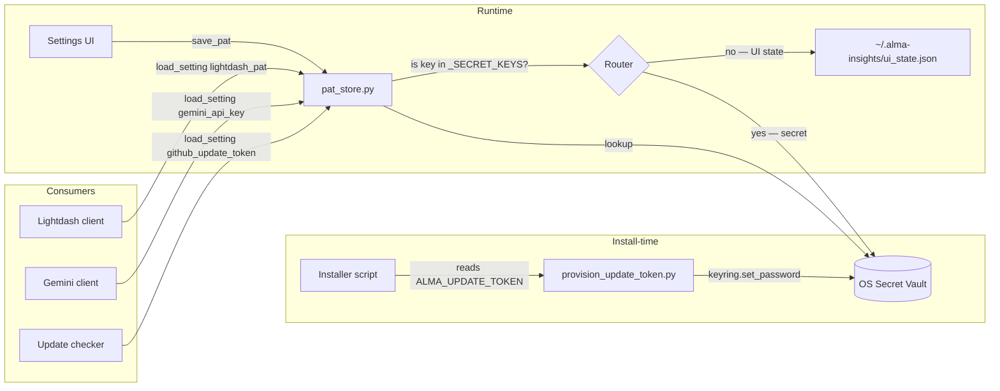
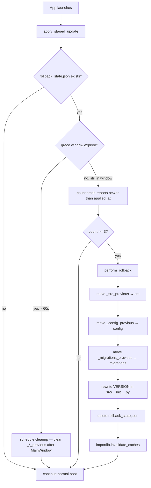
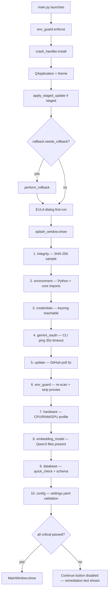
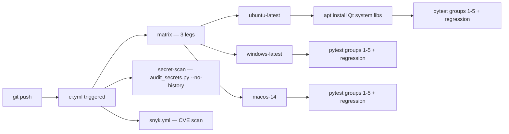
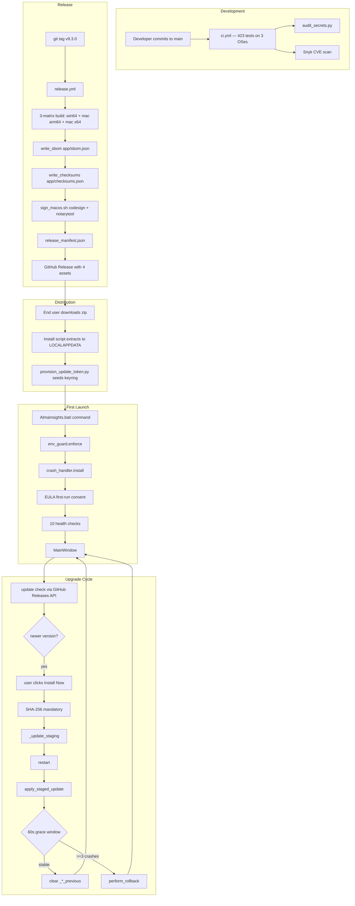

# Alma Insights — CI/CD & Security Briefing (for Claude Desktop)

> **Prompt to Claude Desktop (paste along with the body below):**
>
> I'm sharing a technical briefing on the CI/CD and security architecture of an internal HIPAA-adjacent desktop application called Alma Insights. Please turn this into a polished **Word document (.docx)** suitable for sharing with engineering leadership + internal audit. Preserve all technical detail. Render the embedded Mermaid diagrams as proper inline figures (convert to PNG or SVG). Use clean headings, a table of contents, and a short executive summary at the top. Target length ~8–12 pages.

---

## 1. Executive summary

Alma Insights is a PySide6 desktop application used by RCM operators at Alma Health to analyze ticket and conversation data. Because the app handles PHI under a BAA with Google (for Gemini CLI) and runs on individual user machines rather than a managed server fleet, the CI/CD pipeline had to solve four problems simultaneously:

1. **Supply-chain integrity** — pinned, reproducible builds; every binary independently verifiable
2. **Credential security** — no PATs / API keys in config files or git history
3. **Safe auto-update** — authenticated, checksum-verified, crash-rollback-guarded update flow from a private GitHub repo
4. **HIPAA-aligned data handling** — air-gap env vars set before Python imports, local-only crash reports, first-run consent

The implementation was delivered in five phases over one sprint (Phases 1–5, April 2026) and consists of ~2,500 new LOC across 21 modules, 22 test files with 423 tests, and three GitHub Actions workflows. Everything ships **inert-by-default**: subsystems that require external configuration (the GitHub release PAT, the Apple Developer ID certificate) activate through settings changes + secret provisioning without code modification.

This document explains each subsystem, the decisions behind it, and the operational posture it produces.

---

## 2. Deployment model: pre-installed bundle, not venv

Alma Insights ships as a **self-contained zip archive** per platform, extracted into a fixed user-space location:

| Platform | Install path | Runtime layout |
|----------|-------------|----------------|
| Windows | `%LOCALAPPDATA%\AlmaInsights` | `python\` (CPython 3.12.8 embeddable) + `node\` (Node.js 22.14.0) + `app\` (source) + `_installer\` + launchers |
| macOS (Apple Silicon) | `~/Applications/AlmaInsights` | same structure, python-build-standalone binary |
| macOS (Intel) | `~/Applications/AlmaInsights` | same, Intel variant of python-build-standalone |

This contrasts with the more common venv-based distribution. The bundle approach trades larger download size (~600 MB including the Qwen3 embedding model) for three guarantees end users and IT value:

1. **No system Python dependency** — works on locked-down corporate machines without Python preinstalled
2. **Reproducible runtime** — every user gets byte-identical Python + Node
3. **Clean uninstall** — one directory to delete, no package remnants

The bundle includes an uninstaller (`Uninstall Alma Insights.bat` / `.command`) that preserves user data by default (moved to `.AlmaInsights_data_backup/`) and optionally clears OS-keyring entries.

### Diagram 1 — Runtime bundle layout

```mermaid
graph TD
    A[Alma Insights install dir] --> B[python/]
    A --> C[node/]
    A --> D[app/]
    A --> E[_installer/]
    A --> F[launchers]

    B --> B1[python.exe / bin/python3]
    B --> B2[Lib/site-packages — pinned pip deps]

    C --> C1[node.exe / bin/node]
    C --> C2["lib/node_modules/@google/gemini-cli@0.36.0"]

    D --> D1[main.py]
    D --> D2[src/ — application code]
    D --> D3[config/ — prompts, entity dicts]
    D --> D4[migrations/ — SQL schema migrations]
    D --> D5["data/models/Qwen3-Embedding-0.6B/ — pre-shipped"]
    D --> D6[sbom.json — pip list snapshot]
    D --> D7[checksums.json — SHA-256 per .py]

    E --> E1[install.py]
    E --> E2[uninstall.py]

    F --> F1[AlmaInsights.bat / .command]
    F --> F2[Install Alma Insights.bat / .command]
    F --> F3[Uninstall Alma Insights.bat / .command]
```



---

## 3. Phone-home auto-update

Alma Insights checks a private GitHub repository for new releases on every launch, compares against the installed version, and surfaces an update prompt. The user initiates the download through *Settings → Updates → Install Now*. The mechanism has three auth modes selectable via `data/settings.yaml`:

| `updates.auth_mode` | How authenticated | Typical use |
|---------------------|-------------------|-------------|
| `disabled` (default) | — | No network call. Ships as the default so fresh installs don't try to reach GitHub before the operator has configured credentials. |
| `pat` | Fine-grained GitHub PAT stored in the OS keyring | Simplest path — one token provisioned per machine at install time |
| `github_app` | JWT-minted installation token, 8-hour TTL | Organizational rotation; private key bundled with the app, app_id + installation_id in settings |

Both authenticated modes produce an HTTP Bearer header; everything downstream of the auth layer is identical. The HTTP client is Python's stdlib `urllib.request` (not the `requests` library) — zero network dependencies.

### What flows over the wire

The app sends a single `GET https://api.github.com/repos/{owner}/{repo}/releases/latest` with:
- `User-Agent: AlmaInsights/{version}`
- `Accept: application/vnd.github+json`
- `Authorization: Bearer {token}`

**No user data is transmitted.** Only the running app version (in the User-Agent) and the authentication token. The response is JSON with the release's tag, HTML URL, and asset download URLs.

### Download + verify + stage

When the user accepts an update, the `Updater` class:

1. Downloads the platform-specific zip to a temp directory
2. Verifies the SHA-256 against the value pinned in `release_manifest.json` (an asset attached to every release)
3. **Refuses to stage if the checksum is missing or mismatched** — this is enforced synchronously before the socket opens
4. Extracts the zip into `_update_staging/`
5. Writes `update_meta.json` with the new version
6. Prompts the user to restart

On restart, `main.py` calls `apply_staged_update()` before importing any `src.*` module. That function:
- Renames current `src/`, `config/`, `migrations/` directories to `_*_backup/`
- Moves `_update_staging/*` into place
- Updates the `VERSION` string in `src/__init__.py`
- Rebrands backups as `_*_previous/` (for rollback)

### Diagram 2 — Update flow end-to-end



---

## 4. Credential security

Every sensitive secret the app needs (Lightdash PAT, Gemini/Anthropic/Guru/Zendesk API keys, GitHub update token) is stored in the **OS-native secret vault**:

- **Windows** → Windows Credential Manager via DPAPI (user-scoped encryption)
- **macOS** → macOS Keychain (AES encryption unlocked by user login)

The `keyring` Python package provides a thin wrapper; secrets never touch a Python-readable config file. A process running as a different OS user cannot read them even with filesystem access to `~/`.

### Key classification

`src/data/pat_store.py` maintains a `_SECRET_KEYS` frozenset:

```
lightdash_pat
gemini_api_key
anthropic_api_key
guru_api_token
zendesk_api_key
github_update_token
```

Any call to `save_setting(key, value)` with a key in this set routes to `keyring.set_password(...)`. Any other key (UI state like column widths, cursor positions, view IDs) goes to a plaintext `~/.alma-insights/ui_state.json` — non-sensitive.

### Legacy migration

Pre-Phase-1 builds stored everything in a single plaintext `~/.alma-insights/credentials.json`. On first launch of a keyring-enabled build, the splash's Check 3 (`check_credentials`) detects this file, moves each secret-keyed value to the OS vault, rewrites non-secrets to `ui_state.json`, and renames the legacy file `credentials.json.migrated`. The migration is idempotent.

### What ships to the user

Nothing. Every credential is provisioned either:

- **At install time** via `scripts/provision_update_token.py` (seeds the GitHub update PAT into keyring from `ALMA_UPDATE_TOKEN` env var)
- **At runtime** via the Settings UI (user enters their Lightdash PAT, Gemini/Anthropic keys once)

The shipped bundle contains zero secrets.

### Diagram 3 — Credential flow



### The shipped `audit_secrets.py` tool

`scripts/audit_secrets.py` greps the working tree + git history for five credential-shaped regex patterns (Lightdash, Anthropic, GitHub fine-grained, Google API, generic Bearer). Runs as a blocking CI job on every push. When it found Google API keys in the local Claude Code state during development, it correctly flagged them and we confirmed they were gitignored (never committed).

---

## 5. Versioning strategy

**Semantic versioning at the application level.** Tags follow `vMAJOR.MINOR.PATCH` (e.g., `v9.3.0`). Pre-release tags use suffixes: `v9.3.0-rc1`, `v9.3.0-beta.2`.

### Where the version lives

- **Authoritative**: `src/__init__.py` `VERSION = "9.3.0"`
- **Auto-update payload**: written to `data/rollback_state.json` at apply time so auto-rollback knows the previous version
- **UI display**: Settings → Updates shows the current version; splash header shows the version under the wordmark
- **GitHub release tag**: `v9.3.0`, auto-populated via `git tag`

### Dependency pinning

`requirements.txt` pins every transitive dependency with `==` operators. Examples:

```
PySide6-Essentials==6.8.1.1
pandas==2.2.3
sentence-transformers==3.3.1
numpy==1.26.4                 # held at 1.26 — 2.x breaks torch + sentence-transformers
```

A companion `requirements.lock` is the canonical manifest CI installs from. A `tests/test_phase4_build.py` test enforces that `PACKAGES` in `installer/build_release.py` matches `requirements.txt` entry-for-entry — mismatches fail the build.

### Pinned runtimes

| Runtime | Version | Notes |
|---------|---------|-------|
| Python | 3.12.8 | Embeddable on Windows, python-build-standalone 20241219 on macOS |
| Node.js | 22.14.0 | LTS; hosts the Gemini CLI subprocess bridge |
| Gemini CLI | `@google/gemini-cli@0.36.0` | Bridge-protocol validated; build fails fast if npm install fails |
| ML model | `Qwen/Qwen3-Embedding-0.6B` | HuggingFace repo ID, snapshot-pinned via `huggingface_hub` |

### Schema version (database)

Separate from the app version. `migrations/` directory contains numbered SQL files (`001_initial_baseline.sql` through `025_cluster_member_snapshots.sql`). A `schema_migrations` table tracks applied migrations; `src/updater/schema_migrator.py` applies pending ones at database connect time. An app-version update can ship new migrations that run automatically on the next connect.

---

## 6. Release pipeline

Three GitHub Actions workflows cooperate to produce and publish releases:

| Workflow | File | Trigger |
|----------|------|---------|
| **CI** | `.github/workflows/ci.yml` | Every push to `main`, every PR |
| **Build Bundles** | `.github/workflows/build.yml` | PRs touching installer/requirements/src; manual dispatch |
| **Release** | `.github/workflows/release.yml` | `v*` tag push; manual dispatch |
| **Snyk** | `.github/workflows/snyk.yml` | Every push (dependency CVE scan) |

### Build matrix

All three bundle-producing workflows share the same matrix: **3 legs** producing 3 platform-specific zips.

| OS leg | Artifact |
|--------|----------|
| `windows-latest` | `AlmaInsights-win64.zip` |
| `macos-14` (Apple Silicon) | `AlmaInsights-macOS-arm64.zip` |
| `macos-13` (Intel) | `AlmaInsights-macOS-x64.zip` |

Each leg downloads:
1. Python runtime (embeddable on Windows, python-build-standalone on macOS)
2. Node.js 22.14.0 tarball
3. CPU-only PyTorch wheel from the official PyTorch index (saves ~2 GB vs. default CUDA build)
4. Pinned pip dependencies
5. Qwen3-Embedding-0.6B model via `huggingface_hub.snapshot_download`

Then it assembles them into the staging directory, generates `sbom.json` + `checksums.json`, and zips.

### Build caching

GitHub Actions `actions/cache` keyed on a hash of `build_release.py + requirements.txt + requirements.lock`. Caches `installer/cache/` and `~/.cache/huggingface/`. First build from cold: ~20 min per leg. Warm cache: ~6 min per leg. Invalidation is precise — bumping any dependency version cleanly busts the cache.

### Diagram 4 — Release pipeline

```mermaid
graph TD
    TAG[git push origin v9.3.0] --> TRIG[release.yml triggered]

    TRIG --> M1[build: windows-latest]
    TRIG --> M2[build: macos-14 arm64]
    TRIG --> M3[build: macos-13 x64]

    M1 --> M1S[build_release.py --platform windows]
    M2 --> M2S[build_release.py --platform macos]
    M3 --> M3S[build_release.py --platform macos]

    M1S --> M1Z[AlmaInsights-win64.zip]
    M2S --> SIGN1[sign_macos.sh]
    M3S --> SIGN2[sign_macos.sh]
    SIGN1 --> M2Z[AlmaInsights-macOS-arm64.zip signed + notarized]
    SIGN2 --> M3Z[AlmaInsights-macOS-x64.zip signed + notarized]

    M1Z --> AGG[release: aggregate]
    M2Z --> AGG
    M3Z --> AGG

    AGG --> MAN[make_release_manifest.py → release_manifest.json SHA-256 per asset]
    MAN --> PUB[softprops/action-gh-release@v2]
    PUB --> GHR[GitHub Release v9.3.0 published with 4 assets]
```

---

## 7. Code signing and notarization (macOS)

macOS Gatekeeper will quarantine unsigned applications downloaded from the internet, blocking first-run with a "can't be opened because Apple cannot check it for malicious software" dialog. The release pipeline runs `installer/ci/sign_macos.sh` on the two macOS matrix legs to eliminate this friction.

The script:

1. Creates an ephemeral temporary keychain
2. Decodes the bundled base64 `.p12` certificate into a temp file
3. Imports the cert + private key via `security import` with `-T /usr/bin/codesign`
4. Runs `codesign --force --deep --options runtime --timestamp` with the Developer ID Application identity
5. Verifies with `codesign --verify --strict`
6. Submits the zip to Apple's notary service via `xcrun notarytool submit --wait` (blocks until Apple accepts)
7. Staples the notarization ticket with `xcrun stapler staple`
8. Deletes the temp keychain + cert file via an EXIT trap

### Six required secrets (all stored as GitHub Actions secrets)

| Secret | Source |
|--------|--------|
| `APPLE_ID` | Apple Developer account email |
| `APPLE_TEAM_ID` | 10-char team identifier from developer.apple.com |
| `APPLE_APP_PASSWORD` | App-specific password from appleid.apple.com |
| `APPLE_SIGNING_IDENTITY` | `"Developer ID Application: Full Name (TEAMID)"` |
| `APPLE_SIGNING_CERTIFICATE_P12_BASE64` | base64-encoded `.p12` export of the cert + private key |
| `APPLE_SIGNING_CERTIFICATE_PASSWORD` | password used when exporting the `.p12` |

If any of the 6 is missing, `sign_macos.sh` exits 0 cleanly with a "skipping signing" message — the workflow stays green for forks and pre-enrollment builds. Only after all 6 are configured does signing activate. **Windows code signing is deferred** — users currently see SmartScreen warnings, which is acceptable for internal distribution.

---

## 8. Integrity verification

Every shipped bundle contains two files that let anyone independently audit the binary:

### `app/sbom.json` — Software Bill of Materials

Generated at build time by `installer/build_release.py::write_sbom`. Contains the output of `pip list --format=json` in the bundled Python, wrapped in a small schema envelope:

```json
{
  "schema_version": 1,
  "generated_by": "installer/build_release.py",
  "app": "AlmaInsights",
  "python_version": "3.12.8",
  "packages": [
    {"name": "pandas", "version": "2.2.3"},
    {"name": "numpy", "version": "1.26.4"},
    ...
  ]
}
```

Usable for CVE scanning (e.g., piped into `pip-audit` or the **Snyk** workflow), license compliance, or post-incident forensics.

### `app/checksums.json` — per-file SHA-256

Generated alongside the SBOM. Walks `staging/app/**/*.py` (skipping `__pycache__` and `data/`), produces:

```json
{
  "schema_version": 1,
  "algorithm": "sha256",
  "root": "app",
  "files": {
    "main.py": "abc123...",
    "src/startup/splash_window.py": "def456...",
    ...
  }
}
```

### Runtime verifier

`src/startup/checks/integrity.py` runs as **Check 1** on every app launch. It samples 25 random entries from `checksums.json`, re-hashes those files on disk, and compares:

- 0 mismatches → pass
- 1–5 mismatches → warn (lists files)
- >5 mismatches → **fail critical, blocks app launch** (tampering suspected)

Absent `checksums.json` (developer checkouts) → pass with a "dev checkout" note, so development isn't hindered.

### Snyk scanning

`.github/workflows/snyk.yml` runs on every push and scans the pinned dependencies for known CVEs. Results upload as a workflow artifact. Alongside `audit_secrets.py` (which detects credential leaks in source), Snyk covers **known vulnerabilities in our transitive dependency graph**. The two tools are orthogonal; both matter for supply-chain integrity.

---

## 9. Auto-rollback guard

A newly applied update gets a **60-second grace window** on subsequent launches. Three crashes within that window triggers an automatic revert to the previous version on next launch.

### State tracking

On successful apply, `updater.py` calls `rollback.record_apply()`:

1. Writes `data/rollback_state.json` with `{previous, new, applied_at, grace_window_s: 60}`
2. Renames `_src_backup/` → `_src_previous/` (same for config, migrations). Preserves the previous version on disk during the grace window.

### Detection

Early in `main.py` (before any `src.*` import), `rollback.needs_rollback()` runs:

1. Reads `data/rollback_state.json`
2. If file absent → no rollback needed
3. If `(now - applied_at) > grace_window_s` → stable; skip rollback, schedule cleanup
4. Count files in `data/crash_reports/` with mtime newer than `applied_at`
5. If count ≥ 3 → trigger rollback

### Execution

`rollback.perform_rollback()` swaps `_*_previous/` dirs back into place using a scratch-directory pattern for crash safety, rewrites `src/__init__.py` VERSION back to the previous version, deletes `rollback_state.json`.

### Cleanup

If the grace window expires without tripping, a `QTimer.singleShot(65000, clear_state_if_stable)` fires after MainWindow opens. It removes `_*_previous/` directories and the state file. The update is considered stable.

### Manual override

Settings → Updates → *Rollback to Previous Version* (enabled only while `_src_previous/` still exists) performs the same swap with a confirmation dialog.

### Diagram 5 — Rollback decision tree



---

## 10. Security and compliance posture

### HIPAA air-gap

Alma Insights handles PHI. The app enforces a **hard air-gap for the ML inference path**: the Qwen3 embedding model runs entirely offline against local data; no ticket content leaves the host except through the Gemini CLI subprocess (BAA-covered channel).

`src/startup/env_guard.py` runs at the **very top of `main.py`**, before any `import` statement that could load Hugging Face modules. It sets 10 environment variables:

```
HF_HUB_DISABLE_TELEMETRY=1
HF_HUB_OFFLINE=1
TRANSFORMERS_OFFLINE=1
HF_DATASETS_OFFLINE=1
SENTENCE_TRANSFORMERS_HOME=<bundle>/data/models
WANDB_DISABLED=true
MLFLOW_TRACKING_URI=""
TOKENIZERS_PARALLELISM=false
PIP_DISABLE_PIP_VERSION_CHECK=1
NO_PROXY=*
```

Because Hugging Face libraries read these variables **once at import time**, they must be set before any `import transformers` or `import sentence_transformers` anywhere in the process. That's why `env_guard.enforce()` is the first functional line of `main.py` — before even PySide6 imports.

The same module also strips localhost proxy overrides (`HTTP_PROXY=http://localhost:*`) that a rogue developer extension might have set.

### PII redaction

Every LLM call (Gemini and Anthropic) passes through a mandatory PII redaction layer. Redaction patterns live in `config/redaction_patterns.json`. The flag cannot be disabled at runtime — only by code change + audit.

### Crash reports

`src/core/crash_handler.py` installs a global `sys.excepthook` that writes structured JSON to `data/crash_reports/`. Full tracebacks preserved; only credential-shaped `key=value` patterns are redacted via regex. **Reports are never uploaded** — the user manually exports via *Settings → Updates → Export Crash Reports* if they want to share one with the support team.

### First-run EULA

`src/ui/dialogs/eula_dialog.py` blocks the splash on first launch until the user ticks a consent checkbox. Body covers data handling, Gemini BAA scope, Anthropic scope (operational only), Lightdash data flow, update check scope, crash report scope, keyring credential storage, no-warranty clause. Acceptance is version-keyed; bumping `EULA_VERSION` re-prompts the fleet on next launch.

---

## 11. Startup sequence — 10 health checks

The splash window runs 10 checks in a fixed order before handing off to MainWindow. Critical check failures block the Continue button.

### Diagram 6 — Splash check sequence



---

## 12. Testing infrastructure

**423 tests, organized in 28 files under `tests/`.** Runtime: ~30 seconds locally, ~5 minutes on GitHub Actions matrix.

| Category | Files | Tests |
|----------|-------|-------|
| Phase 1 — Foundation (keyring, hardware, crash, env guard) | 5 | 97 |
| Phase 2 — Splash + health checks | 4 | 62 |
| Phase 3 — Auto-updater | 7 | 53 |
| Phase 4 — Build/integrity/uninstaller | 3 | 27 |
| Phase 5 — Hardening (rollback, EULA, audit, offline) | 5 | 51 |
| Regression (pre-existing Alma pipeline) | 4 | 133 |
| **Total** | **28** | **423** |

### Test philosophy

- **Pure unit tests** for small helpers (path manipulation, version parsing, regex patterns). Fast, no fixtures.
- **Module tests** for each subsystem with in-memory fakes for external dependencies (in-memory keyring backend, mock subprocess for Gemini CLI, patched `urllib.request.urlopen` for HTTP).
- **End-to-end tests** per phase (`test_phase{1..5}_e2e.py`) that compose multiple subsystems and validate the full integration path.
- **Offline mode** (`test_offline_mode.py`) patches `socket.create_connection` + `urllib.request.urlopen` to raise, then exercises every network-touching subsystem. Proves nothing crashes when the network is gone.

### CI workflow



Pre-populated with `pytest.ini` (`testpaths = tests`, `pythonpath = .`) so the suite runs from any directory.

---

## 13. Operational posture

### Current state (April 2026)

- **5 workflows green** on main: CI + Build + Release + Snyk + (test-only runs)
- **4 commits of CI/CD work** on top of 13 prior Alma pipeline commits
- **Apple Developer enrollment**: in-progress — signing currently inert until the 6 Apple secrets are configured
- **GitHub update token**: provisioning documented in `scripts/provision_update_token.py`; `auth_mode: disabled` default means no production machine phones home yet

### Inert-by-default activation model

Every subsystem requiring external setup ships as **off by default, activated by operator configuration**:

| Subsystem | Activation steps |
|-----------|-----------------|
| Phone-home update check | Set `updates.auth_mode: pat`, provision token via `scripts/provision_update_token.py` |
| GitHub App auth | Set `updates.auth_mode: github_app`, add app_id + installation_id to settings |
| macOS signing | Add 6 Apple-prefixed secrets to GitHub Actions secrets |
| Update-rollback auto-detection | Automatic — no activation |
| Crash export button | Automatic — appears in Settings → Updates after first launch |
| Integrity check | Automatic when `app/checksums.json` ships in bundle (always) |
| EULA | Automatic — first launch prompt |

This enables the app to ship and install safely before any infrastructure is fully wired.

### Cost of operation

- **CI minutes**: ~15 min per push on main (3-leg matrix × ~5 min each). GitHub Actions free tier on public repos: unlimited. Private repo: 2,000 min/month free → ~130 pushes/month before billing.
- **Snyk scanning**: Free tier covers small teams; CVE data updates continuously.
- **Apple Developer Program**: $99/year. Required for macOS signing; pays for itself the first time a user on macOS doesn't hit a Gatekeeper warning.

---

## 14. Diagram 7 — End-to-end lifecycle



---

## 15. Summary for leadership

- **Every new subsystem has inert defaults**, so shipping unblocks operations even before infrastructure (GitHub PAT, Apple cert) is fully configured.
- **Every secret lives in the OS keyring**, not in config files or source. The `audit_secrets.py` tool is enforced as a blocking CI check.
- **Every binary is independently verifiable** via `release_manifest.json` SHA-256s + in-bundle `checksums.json`.
- **Every bad update self-heals** via 3-crashes-in-60-seconds auto-rollback.
- **Every user consents explicitly** to the HIPAA data-handling posture on first launch.
- **Every update check is authenticated** (no anonymous GitHub API), short-timeout (5s), and degrades to "offline mode" on network failure.
- **423 automated tests** across 5 phases + 2 security scanners (Snyk for CVEs, audit_secrets for credential leaks) gate every commit.
- **Cost**: $99/year (Apple Developer) + GitHub Actions within free tier. No per-user licensing, no third-party update service.

---

*End of briefing. Claude Desktop should convert this into a polished .docx with rendered diagrams and a table of contents.*
